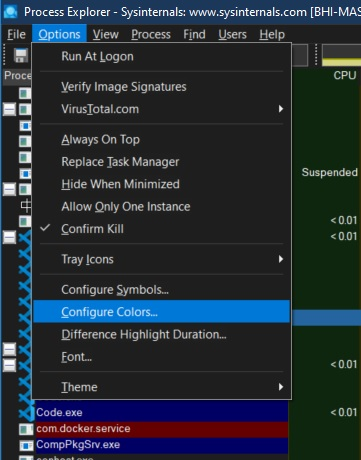
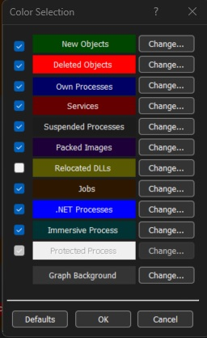
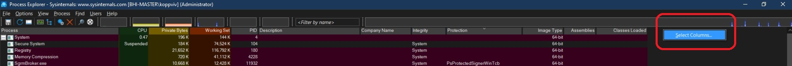

# Process Explorer

1. This is an advanced tool. 
2. Download [it form here](https://learn.microsoft.com/en-us/sysinternals/downloads/process-explorer)
3. Ever wondered which program has a particular file or directory open? Now you can find out. Process Explorer shows you information about which handles and DLLs processes have opened or loaded.
4. You should run this as Admin, this will give more info. PE can be thought of as a Enhanced super Task Manager. PE has got more columns. 
5. Configure colors
   
    

6. And here is the color selection.

    

7. Select colomns as follows to the exlorer.

    

8. Select Columns as follows.

    

9. 