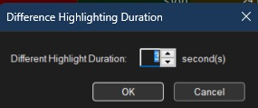
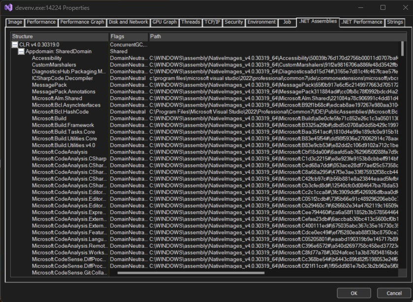

# Process Explorer

1. This is an advanced tool. 
2. Download [it form here](https://learn.microsoft.com/en-us/sysinternals/downloads/process-explorer)
3. Ever wondered which program has a particular file or directory open? Now you can find out. Process Explorer shows you information about which handles and DLLs processes have opened or loaded.
4. You should run this as Admin, this will give more info. PE can be thought of as a Enhanced super Task Manager. PE has got more columns. 
5. Configure colors
   
    

6. And here is the color selection.

    

7. Select colomns as follows to the exlorer.

    

8. Select Columns as follows.

    

9. New objects are colored green. <kbd>⊞ Win</kbd>+<kbd>R</kbd> and then cmd, to start a cmd. You will notice that this is marked as green. This color appears for a few seconds. You can change it as follows.

    

and we set it as follows.

    

10. Dotnet process. The color for dotnet process are dark blue. Click the item.

    

11. You need to be an admin to see the following. Explore different tabs such as dotnet performance. 

12. 