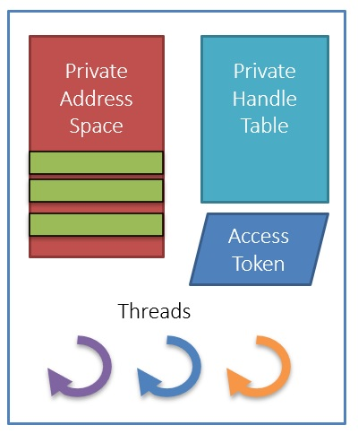
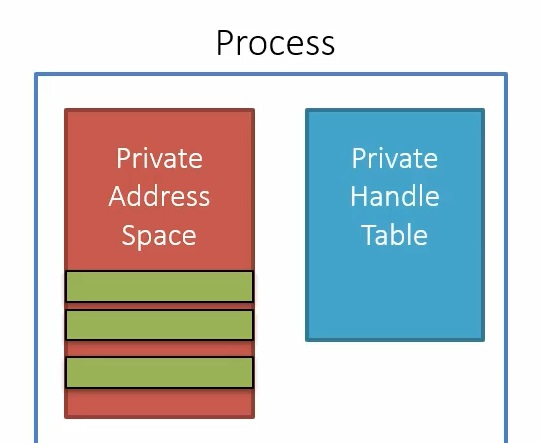

# Title
1. Process Fundamentals.

## Notes

1. `Process` 
   1. A container object which holds all the resources used to execute a program.
   2. A fundamental building block in windows OS.

   2. A process consists of

      1. A private virtual address space. It is this Virtual Address Space where the process allocates all its memory.
         1. Every process has its own private address space. This means, if I have an address of 1000, then I need to ask in which process context this address is.  

      2. An executable program (image), which contains the initial code and data to be executed

      3. A table of handles to kernel objects. This is private to the process. For example, a handle to a file that is created or opened by a process. This file handle is stored in this table, and this cannot be used by another process. Using a windows api functions, we ask the kernal to create this handles. Once we have these handles, we store them in this table.
      
      4. A security context, called an `access token`. This token encapsulates all the security information, related to who is running the process, the user name, the groups it belongs to, the various previlates etc. This is the main way windows decides if an access is allowed to when its time to open some kernal object. 

         1. Used for security checks when accessing shared resources

      5. One or more threads that execute code
      6. When a process is created, a default thread is created with it, and this is the one that executes the main method.

   3. There are two main ways in which we can view process information, one is Task manager and other is process explorer. 

   4. [Task Manager](./TaskManager.md).
 
   5. [Process Explorer](./ProcessExplorer.md).

   6. 

## References

1. 

2. 

