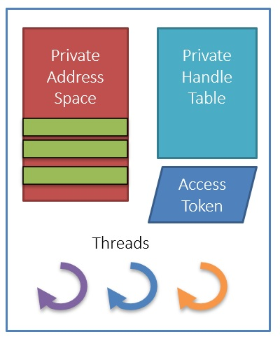

# Title
1. asdf
2. asdf

## Notes

1. `Process` 
   1. A set of resources used to execute a program

   2. A process consists of

      1. A private virtual address space

      2. An executable program (image), which contains the initial code and data to be executed

      3. A table of handles to kernel objects

      4. A security context, called an access token

         1. Used for security checks when accessing shared resources

      5. One or more threads that execute code

   3. [Task Manager](./TaskManager.md).
 
   4. [Process Explorer](./ProcessExplorer.md).
   5. Here we go..

## References

1. 

2. 

