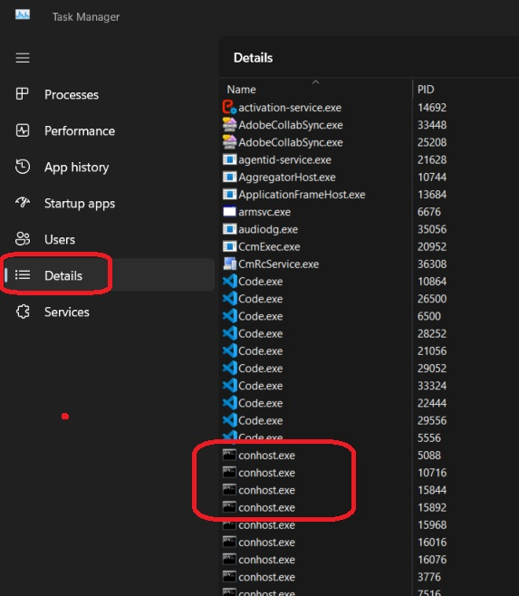
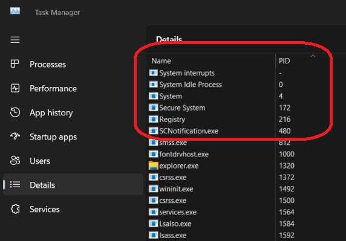

# Task Manager

1. The details tab is more useful. 
    
2. The name column is just the name of the executable. 

3. The process id is the one which uniquely identifies the process.

4. The following processes are initial processes and are kernel processes.
    
5. 