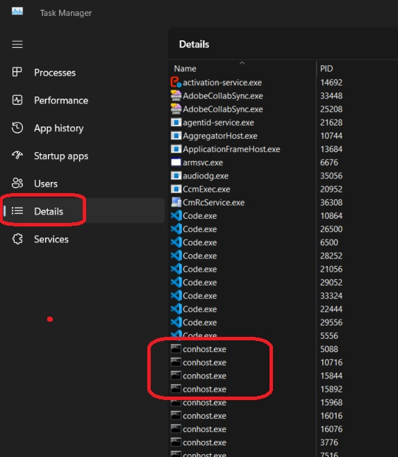
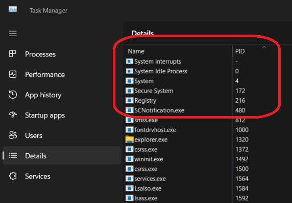
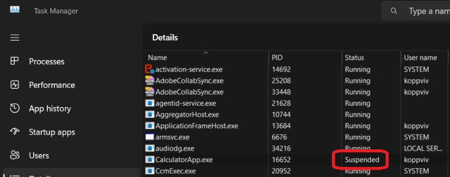
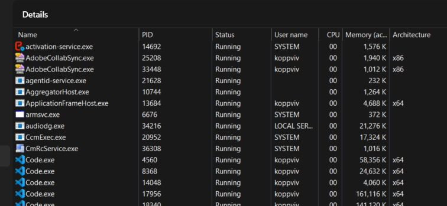
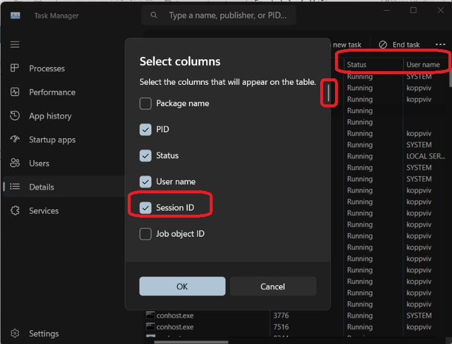
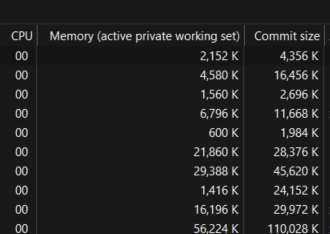
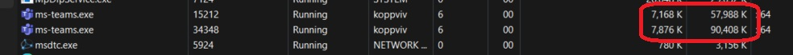

# Task Manager

1. The details tab is more useful. 
    
    

2. The name column is just the name of the executable. 

3. The process id is the one which uniquely identifies the process.

4. The following processes are initial processes and are kernel processes.
    
5. The status column is partly confusing.
   1. Running, Suspended etc.
   2. Open any modren application such as Universal Window Apps. A good example is calculator. Open the calc 
   3. Window Key + R -> calc -> press enter.
    
   4. In the task manager, look for the calculator task. Notice that the status is running. Now minimize the calc app. Now notice that the status changes to suspended. 
   5. So when the app is minimized, the kernal forcefully suspendeds the app, so that the app does not get any CPU 
   6. The other status is Unresponsive. Sometimes, a windows gets unreponsive. This happens when the UI thread is unable to check its message queue for 5 secs. 
   7. If the process has no UI, its almost always be in running state. The term `Running` is confusing. In most cases, its idel, doing nothing. Its CPU time is zero.
    
6. Notice the user name column. This is where the access token we saw earlier comes in. SYSTEM, NETWORK SERVICE and LOCAL SERVICE are special accounts.
7. Right Click any header, see the following, status, user name or any other column header and choose slect coloum.
    
8.  Then there is session. Session 0 is for system processes, and session 1 is for logged on user.
9.  Memory, or the active private working set(APWS). The name here is confusing. 
10. This is the amount of physical RAM that is consumened by that process for private memory. 
11. Private memory is private to the process. This is a bad counter to look at becacuse this is misleading. 
12. This number shows the amount of RAM that is being used but the real amount of memory consumed is typically higher. 
13. A better counter would be commit size. This shows the committed memory, some of which is in physical memory and some of which may not in physical memory. 
14. 

    

15. The commit size is always larger than the 
16. In some cases, the physical memory is close to APWS. This means that process is using most of the memory quite frequently, 
17. And in other cases, the numbers differ quite a bit. For example, here we have microsoft teams. We can see that it allocated more memory than it comsumed. 

    

18. You can also include handles and threads in the columns. Handles show the number of the handle in the handle table. The number of threads in the process should be atleast one. 

   1.  asdf
19. 