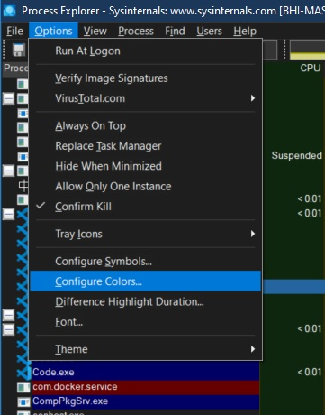
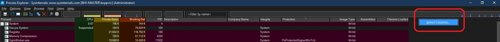

# Process Explorer

1. This is an advanced tool. Super task manager. 
2. Download [it form here](https://learn.microsoft.com/en-us/sysinternals/downloads/process-explorer)
3. Ever wondered which program has a particular file or directory open? Now you can find out. Process Explorer shows you information about which handles and DLLs processes have opened or loaded.
4. You should run this as Admin, this will give more info. PE can be thought of as a Enhanced super Task Manager. PE has got more columns. 
5. Configure colors
   
    

6. And here is the color selection.

    

7. Select colomns as follows to the exlorer.

    

8. Select Columns as follows.

    

9. New objects are colored green. <kbd>⊞ Win</kbd>+<kbd>R</kbd> and then cmd, to start a cmd. You will notice that this is marked as green. This color appears for a few seconds. You can change it as follows.

     
    
    and we set it as follows.

    

10. Dotnet process. The color for dotnet process are dark blue. Click the item.

    

11. You need to be an admin to see the following. Explore different tabs such as dotnet performance. 

    

12. Now notice the windows explorer processes. They are categorized with the same color as immersive process, 

    

    The reason is because, the windows explorer also uses windows runtime aps. So windows explorer is of the sam ecolor as a calculator. The calculator is a UWP. 

    

13. Now services. There seems to be some conflict between jobs and services. When it comes to coloring, there seems to be conflicts going on between jobs and services. So just select services and deselect jobs as follows.

    

    Now select any service, you can see services tab in there.

    

14. Svc host services. Its a common way, by which windows hosts its own services comming from microsoft. Windows comes with many built in services, and many of them are started automatically. Most svchost processes host single services. But there are exceptions though.

    

    Note the user name, or the account under which these svc host services run. The SYSTEM account is the most power ful account, so any hacker injecting into these process, can do practially anything. That should be born in mind.

15. There are three ways to sort the processes in process explorer. So click on the header of process name, three times.

    

16. So if a process creates another process, then the first process is parent of the second. But note that, does not mean there is a dependencies between parent and child. The child can continue to live with the parent, that is, if the parent is terminated, the child will continue to live. The life time is completely independent. 

    

17. Note that the process ids can be reused. So if we really want a unique id, then take the id and start time togather, which will give you a unique identifier. 

18. Lower Pane. You can start the lower pane, in two ways, clicking the icon or by View -> Show Lower Pane 

    

19. It actually looks like the following where it shows the dlls loaded in that process. You can see the handles and threads as well. 

    

20. The following shows how to add more columns to handles grid by right clicking the header in of the respective grid. 

    

21. 