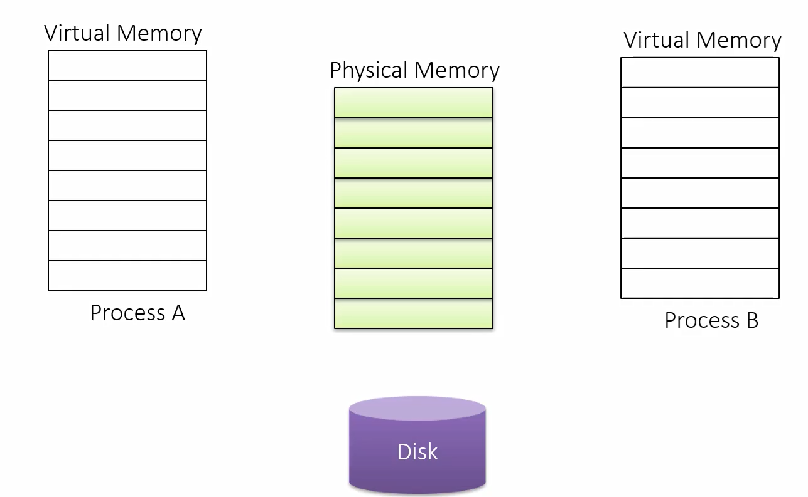
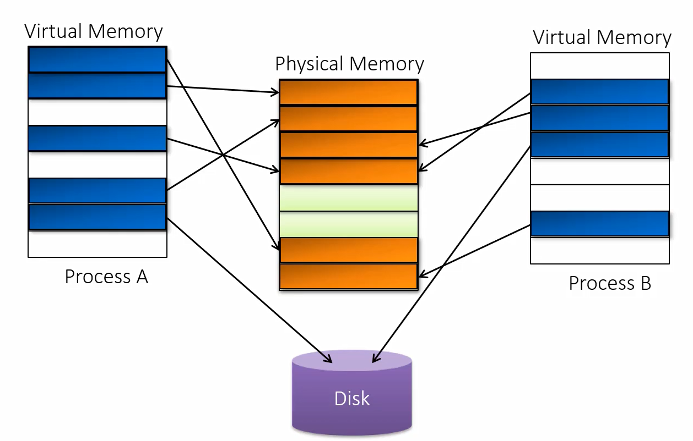

# Virtual Memory

## Notes
1. Every process sees a flat linear memory starting with address 0 to some limit. Every process thinks it has a chunk of memory to use. That address space starts out to be empty. 
2. Internally, virtual memory may be mapped to physical memory, but may also be stored on disk.
3. Why is memory called virtual? Thats because, there is no direct connection between, the address that we use as a part of our process, and the actual address that is in physical memory. Infact it can be mapped out to a disk such as a page file for instance. 
4. So virtaul memory means two things.
   1. The mapped memory could be on physical memory or disk
   2. And if it is on a physical memory, we dont know where it is in physical memory.
5. Processes access memory regardless of where it resides
6. The memory manager handles mapping of virtual to physical pages. It creates various tables that allow the cpu to perform the actual mapping. The CPU is the one that does the translation. The process does not know where the physical memory is present in the RAM, it does not have to. 
7. Every memory chunk is always in terms of pages.

    

8. Allocation can be as follows.
    
9. Its possible for two or more processes to share page or pages. This happens a lot to conserve physical memory.

10. Many Dlls which are used by most process such as kernel32.dll, user32.dll and many other, are mapped to physical memory only one, and other processes can use the same copy. 

11. 

## References
1. https://www.youtube.com/watch?v=qcBIvnQt0Bw&list=PLiwt1iVUib9s2Uo5BeYmwkDFUh70fJPxX
2. https://www.youtube.com/watch?v=qcBIvnQt0Bw