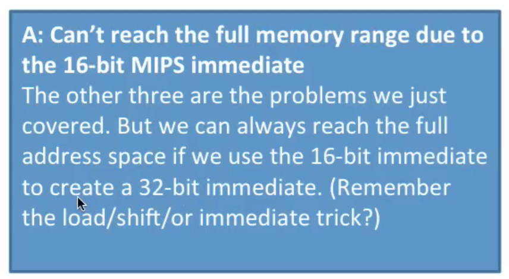

# Three problems with Memory

## Some pre reqs

1. What is MIPS. Its a [computer architecture. Microprocessor without Interlocked Pipelined Stages](https://en.wikipedia.org/wiki/MIPS_architecture)

2. [Instruction set architecture or ISA] is an abstract model that generally defines how software controls the CPU in a computer. MIPS is an ISA.

3. `Load word` and `store word` are instructions used by processors to access and manipulate data in memory:
   1. `Load word` Moves data from memory into a register. For example, the MIPS instruction lw loads a word into a register. The syntax for load word is lw Destination Reg, offset(Address Reg).
   2. `Store word` Moves data from a register to a memory address. 
   3. For example, the MIPS instruction sw stores a word. The syntax for store word is sw Source Reg, offset(Address Reg). 
   4. Both load word and store word instructions require specifying a register and a memory address.

4. What is an [address space](https://en.wikipedia.org/wiki/Address_space)? 
   1. In computing, an address space defines a range of discrete addresses, each of which may correspond to a network host, peripheral device, disk sector, a memory cell or other logical or physical entity.

## Three problems

1. The first of these problems is **what if we don't have enough memory**.
   1. The [MIPS architecture](https://en.wikipedia.org/wiki/MIPS_architecture) gives each program its own 32-bit address space. 

   2. When we do `load word` or `store word` we specify a 32-bit address. So that means the program can access any byte in their 32-bit address space.

   3. So the MIPS ISA makes this promise that every program can access 32 bits of address space. 

   4. So now how much memory can you access with 32-bit address space?

      1. Well you can access two to the 32 bytes or four gigabytes of memory. 
      

      2. So theoretically you can access four gigabytes of memory. So theoretically we've promised each program to get four gigabytes of address space.

      3. But in practice the operating system reserves some of this, so it's really closer to two gigabytes

      4. But for simplicity we'll just look at giving each program its full 32-bit address space or four gigabytes of memory 

   5. Okay so here's the problem. What if you don't have four gigabytes of memory in your computer? So go back four years nobody had four gigabytes of memory in their computer. Now it's pretty common but what did people do before they have this much memory? So let's take a look at the problem here. 

   6. Here's the 32-bit address space that MIPS promises. So MIPS promises a program it can access any byte within this range from all zeros to all Fs. So any byte in four gigabytes of space.
      

   7. Now say I have a computer which only has one gigabyte of memory installed so that's a 30 bit RAM address space
      

   8. It's a quarter the size of the promised four gigabytes. So I've only got one gigabyte of memory in my computer.

   9. So what happens here? Well if I go to access the first part here in MIPS, access the first part of memory,  that's not a problem. Second part okay, third part okay, 
      

   10. Now what happens when my program tries to use more than the one gigabyte of memory that's in my machine? 

   11. Well there is no memory here. So if I don't have virtual memory I'm going to go ahead and crash; there's no way to access this part of the address space. If I access it the program will crash because there's no physical memory sitting there. 
      

   12. So this is the first problem with memory. We promised each program a thirty two-bit address space, but the actual amount of memory address space we have depends on how much RAM is installed. 

2. [Here's another problem.](https://www.youtube.com/watch?v=eSPFB-xF5iM&t=141s) **Holes in our address space**. 
   1. So when we have multiple programs running together 
      1. How do they share the memory and 
      2. Where do we put them?
   2. So here's our 32-bit address space and now we have a computer that has the full four gigabytes of memory, the full amount of memory(RAM) it can.
   3. We've got a bunch of programs here so program one wants one gigabyte program two two and program three wants two also. 
      
   4. So programs 1 and 2 fit together, so here I'll go ahead and run program 1 and put it into memory run program to put into the memory they use 3 gigabytes of memory together so I still got one gigabyte free 
      
   5. Now what happens when I quit program 1? So when I quit program 1, I freed up a bunch of space, so now I have 1 gigabyte above and one gigabyte below. 
      
   6. But I can't run program 3 even though I have 2 gigabytes of memory is free and program 3 needs 2 gigabytes of memory. Its split up. 
   7. Got one gigabyte above and one gigabyte below, I don't have anywhere 2 gigabytes of memory continuously by which I can run program 3. 
   8. So this is what is called as memory fragmentation. I get these holes in my memory due to the order in which I ran programs. 
3. Now let's look at the third problem with the memory. How do we keep our programs secure? 
   1. As we know each program can access any 32-bit address. What if multiple programs access the same address?
   2. Let's take a look at example here we have two programs that are both going to issue this instruction, - `store word r2 1024 r0(sw R2, 1024(R0))` 
   3. This instruction is going to write to address 1024. 
   4. Above is one program Program 1, a bank account program and below is another program, a video game program.
      
   5. Program 1 is storing my bank balance it's going to store my bank balance at address 1024.
   6. Now program 2 is going to store my video game score and well it's going to store it to address 1024 as well 
   7. So here I've run two programs both of which are writing to address 2024 and they've overwritten each other.
      
   8. What happens here? Well they're corrupting each other. Thats because we don't have any way to separate what memory they're accessing. 
   9.  They're both trying to access memory 1024, which is perfectly legal they're bumping up into each other 
   10. We don't have any way to keep programs separate.
   11. We can cause this corruption or crashes and this is why programs and computers crashed an awful lot a long time ago because we weren't using virtual memory.
4. In summary, the problems with memory we looked at are, we saw that 
   1. If all of the programs have access to the same 32-bit memory space 
      1. They can crash if we don't have four gigabytes of memory installed. Thats because MIPS promises 32-bit addresses which is four gigabytes
      2. They can run out of space if we run multiple programs because we get these holes in our memory 
      3. And we can corrupt each other's data so if two programs, both write to the same address they corrupt.
5. So how do we solve this? Virtual memory.  so the key to the problem was this thing `same 32-bit memory space`.
   1. So the reason we're having all these problems is that we have this `same memory space` for everything. 
   2. Every program has the `same memory space` and our actual RAM has `same memory space`. 
   3. Because it's all the `same` we don't have any flexibility.
   4. So if we can give `each program` its `own virtual memory space` then we can start solving these problems 
   5. That's what `virtual memory` does, it gives each program its own `virtual memory space` and then maps it to the physical memory 
   6. `Virtual Memory` is going to `separately map` each programs `memory space` to the `RAM memory space` 
   7. With `virtual memory` we have a whole `bunch of these memory spaces` 
   8. We have a `seperate memory space` for each program called its `virtual memory space` 
   9. We have a `memory space for the RAM` called the `physical memory space` and then we're going to have this `map` in the middle that maps the `program memory spaces` to the `RAM memory spaces` and that's really all virtual memory is.
      
6. What we can also do is we can move data to disk. 
   1. So if we run out of memory we can map some of the programs memory space, instead of to RAM, we can map it to disk. 
   2. We can use our hard disk as memory.
7. That's what the term `virtual memory` comes from it's not real memory it's a `virtual memory`
8. The key here is the `mapping` that gives us the `flexibility` and `how we use the physical memory` 
9. Here's a question about `shared address spaces`

10. And the answer

11. can't reach the full memory range due to 16 bit immediate we saw that we can make a 32-bit immediate by using 2 16 bit immediate sand 2 instructions so we can create that but the other ones are the problem reading some addresses will cause a crash if we don't have 4 gigabytes of memory programs can overwrite each other's data if they have the same address space and they may not fit together we may get these fragmentation or holes if they're all using one rememory space

## Reference
1. https://www.youtube.com/watch?v=eSPFB-xF5iM
2. 