# So What is Virtual Memory

## Notes
1. Virtual memory is all about `indirection`.

2. There are different address spaces for the program and the memory and virtual memory is about the in direction pointing between them.

3. Virtual memory is a layer of indirection. This comes from the general idea that any problem in computer science can be solved by adding indirection if you got a problem add a layer of indirection and you can almost always solve it.

   1. Without virtual memory we don't have indirection. The `program address` that the program uses in MIPS is exactly the same as the `RAM address`. So if the program tries to load from address 2024 it's going to look for RAM address 1024 

   2. Here's(left blue stack) our 32-bit address space the program(MIPS) guarantees and here's(right green stack) our 32-bit address space. If we only have one gigabyte of RAM in our computer and we saw before these addresses are fine address 0 is going to map over here to 0, 1 - 1 etc, all the way through the first gigabyte.

    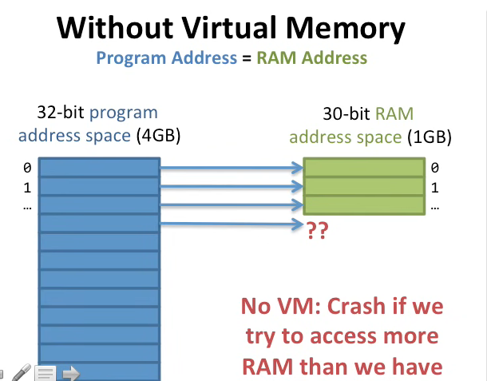

   3. But the problem starts when we start using addresses that are beyond the first gigabyte. They don't have anywhere to map to, so with this direct mapping here we're going to crash if we try to access more memory.

   4.  Virtual memory is going to solve this by adding a level of indirection. With irtual memory we're going to take the program addresses and map them to a ram address. Instead of going 1 to 1 like this we're on a slightly different mapping.

    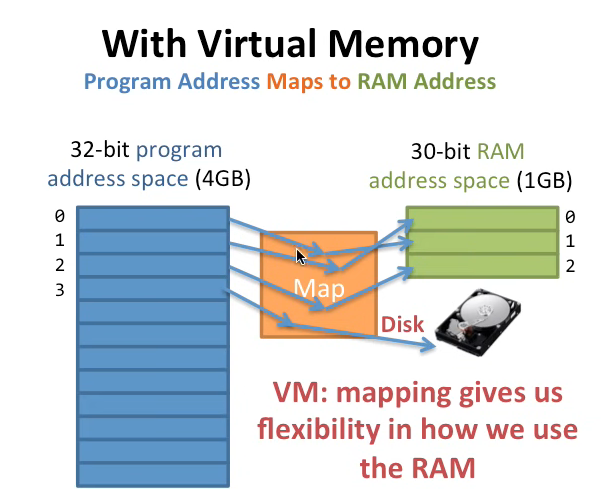

   5. Here's virtual memory and it's gonna do this mapping. We have our 32-bit program address space and we still only have one gigabyte of memory installed in our computer. But now we're going to have this map in the middle and this map is going to provide exactly this indirection that I was talking about before. so let's see how this can work with the map so here's address 0 where's it going to go to well we look in the map the map sends it over here(middle) to ram address 1. Why not it can map it to anywhere it wants. Next one it Maps it up here to address 0. Here comes the next one it Maps it into here now we've done the same thing we've done here we've mapped everything it's not the same mapping but it's just a mapping what happens now when we access this next piece of data well now that we have a map this next piece of data can say hey it's not in memory(RAM), it's somewhere else. It's on the hard disk for example so our program is not going to crash. It's going to know it has to go get the data from the hard disk before can continue. 

   6. What virtual memory does here is it gives us `flexibility` in how we can use our memory here so this mapping allows us to use our memory in a more `flexible` way.

4.  Let's take a look at how `virtual memory` solves these three problems that we looked at before.

5. The first problem is `not enough memory`. 
   1. Here's our same 32-bit address program space and our same one gigabyte 32 30 bit ram address space so we have one gigabyte of memory installed and MIPS promises four gigabytes of memory space to every program.
   2. We've got this map in the middle and we've got a disk over here where we can put stuff that doesn't fit. We're going to map some of the programs address space to disk when it doesn't fit and when we need it we'll bring it into memory.
   3. So here we are with virtual memory and remember the program address is going to map to the RAM addresses so the program goes and tries to load address zero goes to the map the map says ah ok address zero is over here no problem you can access it so the virtual memory has mapped program address 0 to RAM address 1 

        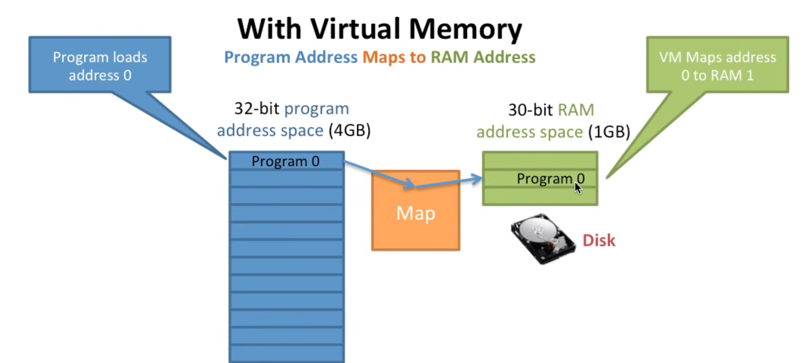

   4. Now the program wants to access will address 1, ok, so we go into the map and the map goes over here and it maps address 1 to RAM address 0. 

        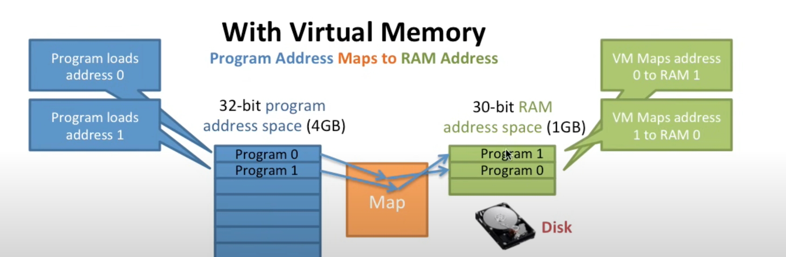

   5. Now program address 2 it goes and maps it down to 2 here.

   6. Next, we try to load the program address 3 the next one here and this one doesn't fit into the amount of memory we have here so this part here took up our first gigabyte of memory now we're trying to load something beyond 1 gigabyte. 

        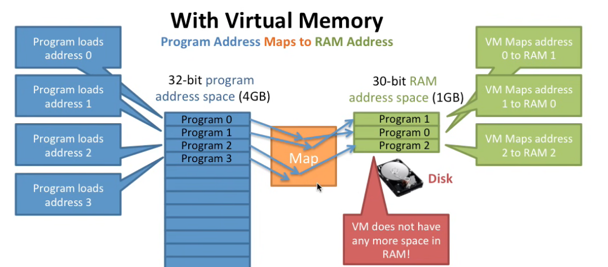

   7. The map says hey I don't have any more space in your memory that's installed in your computer for this data, what am I going to do(because I have this flexibility) I can move the data around so it's going to go put it on the disk.

   8. The virtual memory is going to find the oldest piece of data in memory in this case it's a 0 1(Program zero at place 1 in RAM) here it's going to go and move it out to the disk. This is called a `page out`. 

        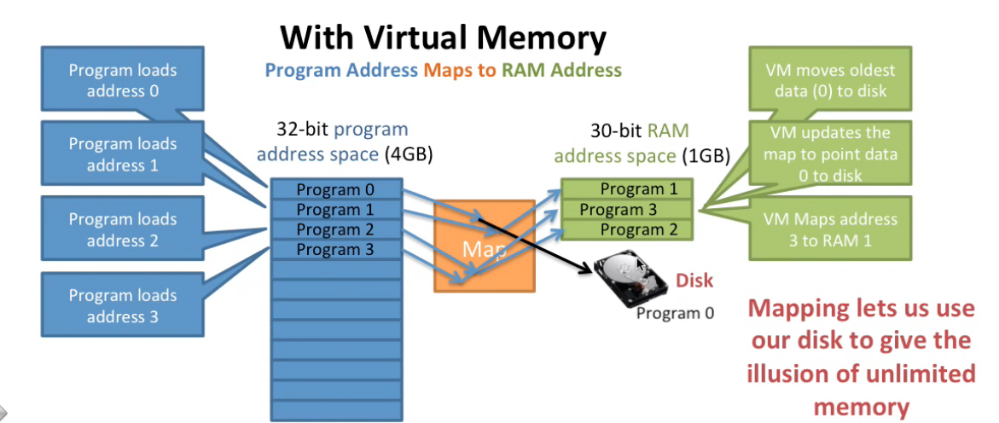

    9. It's taking this page of memory and writing it out to disk then it's going to go and update the map so the map here still says that this is in memory I'm going to update that map to say nope it's not in memory it's on disk now that we've freed up this memory here now we can go ahead and access program at address 3 here and in the memory that we freed up from that earlier data.

    10. So by having this mapping we can use our disk to give us the illusion of unlimited memory so as long as we have four gigabytes of space on our disk we can always give every program four gigabytes of memory because we can do this mapping and put as much of the data on the disk as we need to.
   
    11. So that's how virtual memory solves the problem of `not enough memory`. 

    12. What about virtual memory performance? what's going to happen to the program performance when the data it needs is on the disk?

        

    13. Well we're going to get really bad performance reading from disks is slow just sort of thousands of times slower than memory so if we have to put the data on the disk it's going to slow down our performance enormously

        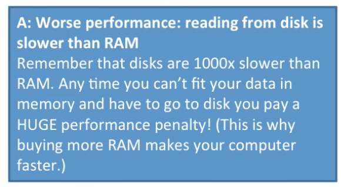

    14. This is why people tell you if you buy more memory for your computer it'll run faster because you'll have less time you have to go to the disk to access data 
   
6. Now problem number two this was the `holes in the address space`.

   1. To recall, the problem is the following.
        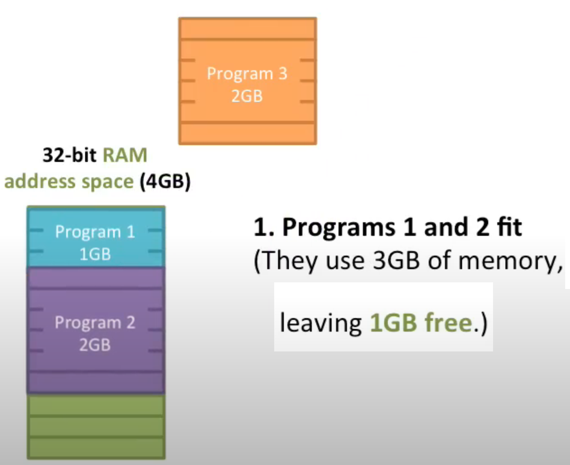
   2. So remember we quit program all over one up here and it left these two one-gigabyte holes and we decided we couldn't run program three because it didn't fit into either of these holes 

        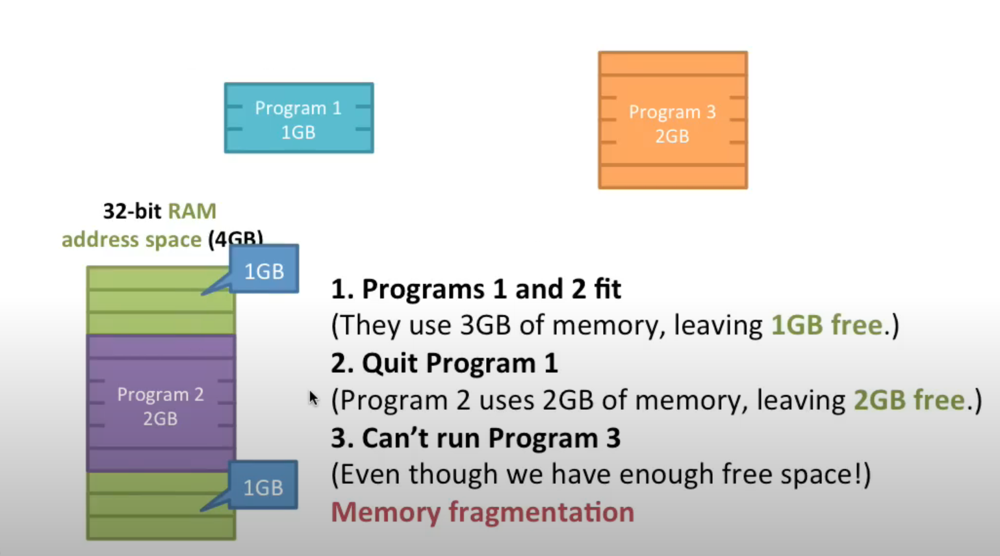

   3. Now we're going to have this map so we can be more flexible in how we use the memory so here's program three in program two here's program two's map. And as we saw program two was mapped into the middle chunk of memory here. 

        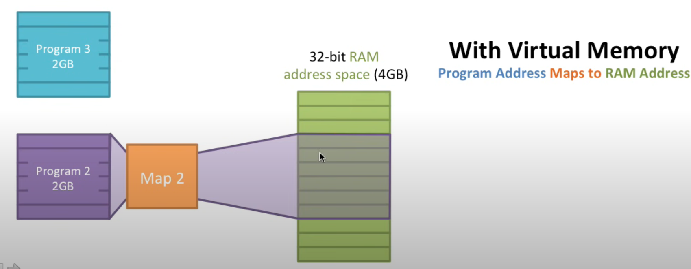

   4. But with virtual memory we can map program three wherever we want. 

   5. So here's program threes map. we're going to take the first part of program three we'll map it up here(top of green stack) we'll take the second part of program three and we'll map it down here(bottom green stack).

        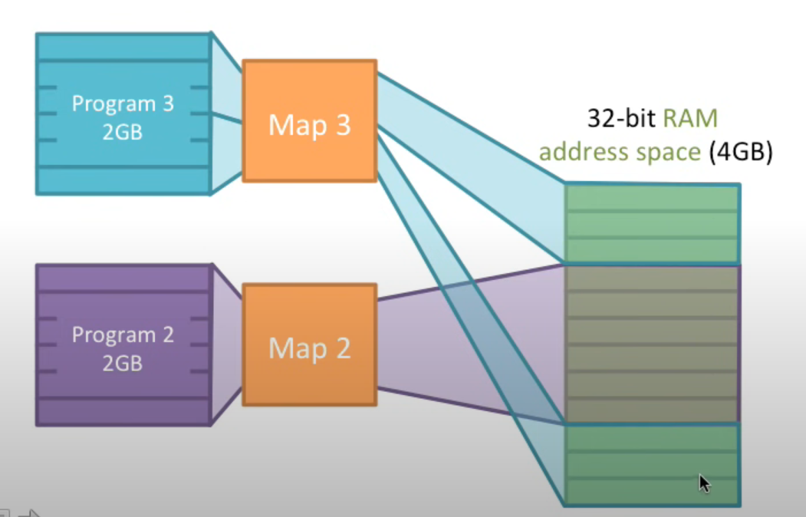

   6. Now program threes memory is split around program twos. But it doesn't matter because this mapping allows us to map any part of program threes memory to any part of our real memory.

   7. We got this added flexibility from having these mapping and now we could fill up these holes and really use all of our memory 

   8. So with each program having its own mapping we can put our data wherever we want and we can be more flexible about using these holes in memory.

7. Now the third problem here `keeping programs secure`. 
   1. So here's program 1 and program 2 and remember what's going to happen.

        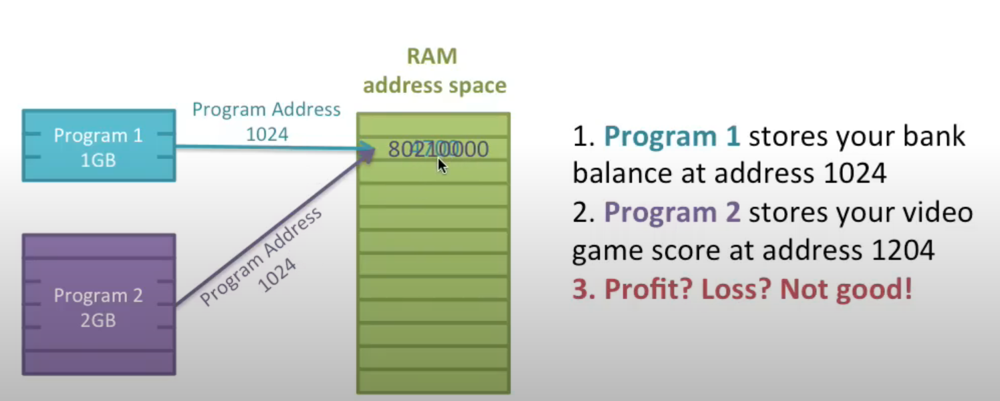

   2. Program 1 is going to store your bank balance at address 1024 and program 2 is going to store your video game at address 1024.

   3. So we're going to use maps for them to put them in different RAM addresses.
   4. So program one has a map and program two has a map. 
   5. Program one is going to go to per address 1024 and its map is going to send the data somewhere.
   6. So in this case we're sending the data over here to ram address 1 
   7. Now program 2 is also going to try and access address 1024 but it's map is going to send the data somewhere else.
   8. So in this case it's going to send it over here to ram address 5.

        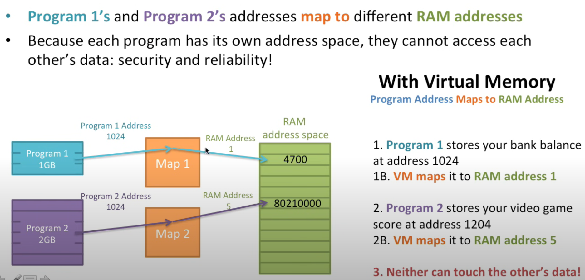

   9. So now they write two different places because we have these mappings that make sure you even though each one of them is trying to access 1024 they have `different mappings` that send them to different physical locations in memory and they don't overwrite.
   10. So neither one of them can touch the other one and we got this security they each have their own address space and they can't access each other's maps as long as we don't map them over each other 
8.  Here's a question about program isolation. We just showed you how you can isolate programs here. Is this always good? if you completely isolate the programs what's a downside of this? 
   
    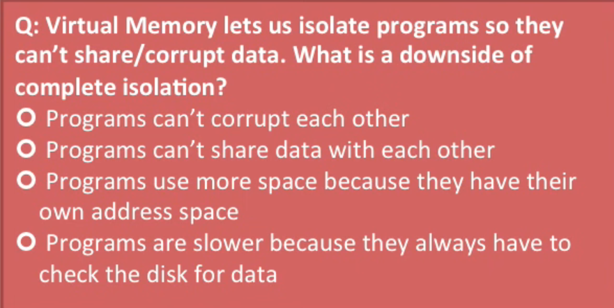

   1.  The downside of this if you do it entirely as you can't share data 
   2.  Programs often share a lot of data. If I have this mapping where they're completely isolated they can't share that.

    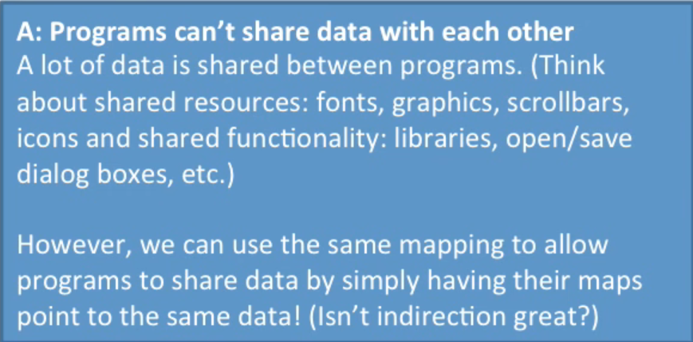

9.  Sharing Data between the processes. We can use the same mapping to enable shared data. Say I have a mapping here that map's part of program ones addresses down here(see black arrow) and another mapping that map's part of program twos addresses right here(see the black arrow).

     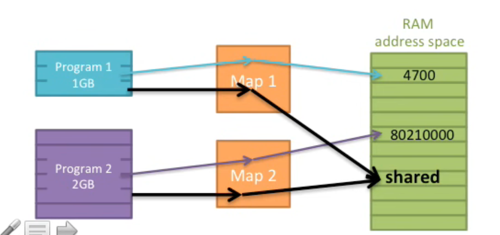

    1. Now they can explicitly share that same data regardless of where they need to access it. And this is actually very common. 
    2. If we take a look at this here here's the save dialog box from my mail program and here's the save dialog box from my web browser you'll notice these are exactly the same all of the code and all of the icons and graphics for both of these dialog boxes are the same so you want these to be shared between each program. 
    3. The memory that represents the save dialog boxes that's going to be shared between the two programs so we need to make sure they can do the sharing so save dialog box fonts graphics all those things are examples of data that you want to share between programs.
    4. Many Dlls which are used by most process such as kernel32.dll, user32.dll and many other, are mapped to physical memory only one, and other processes can use the same copy. 

10. 

## Reference
1. https://www.youtube.com/watch?v=eSPFB-xF5iM
2. 