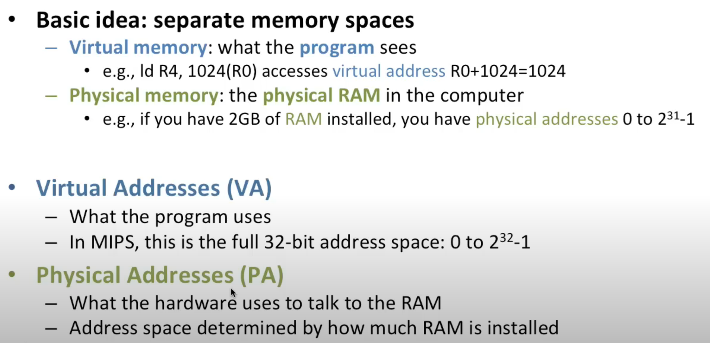
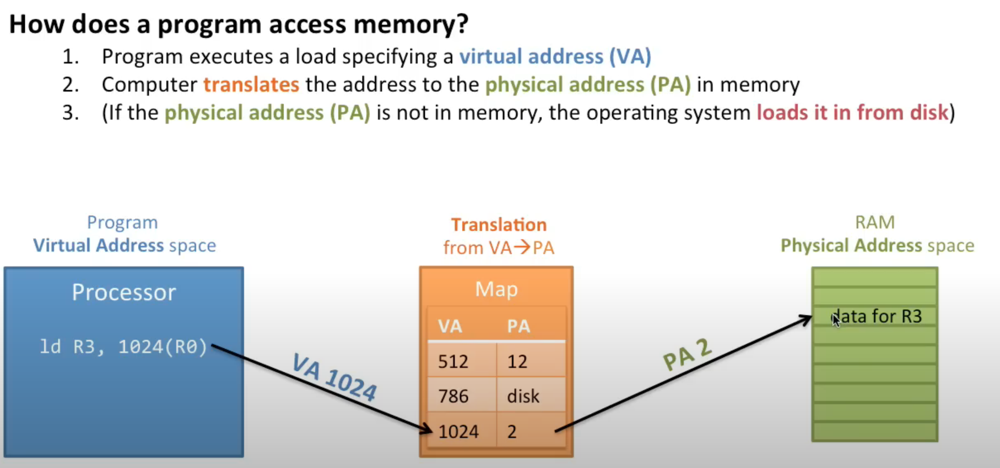
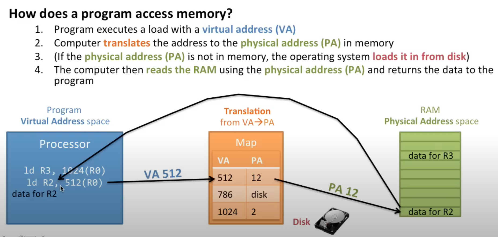
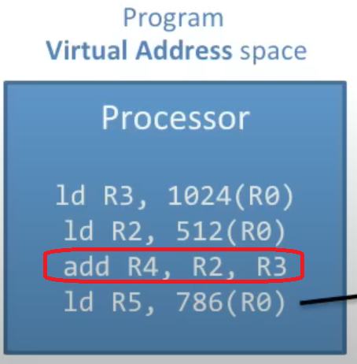
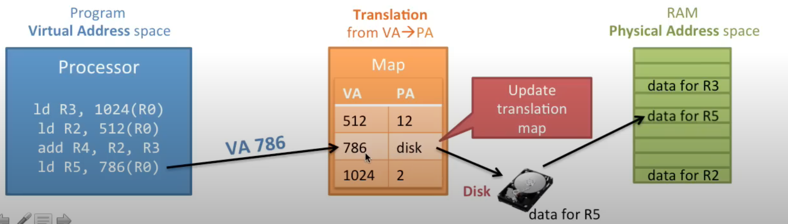
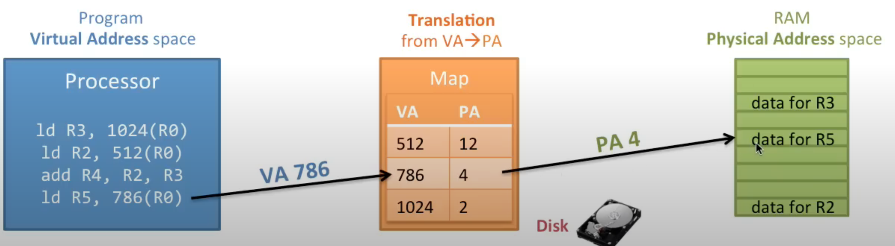
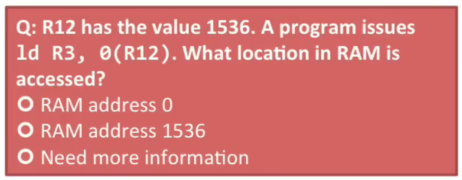
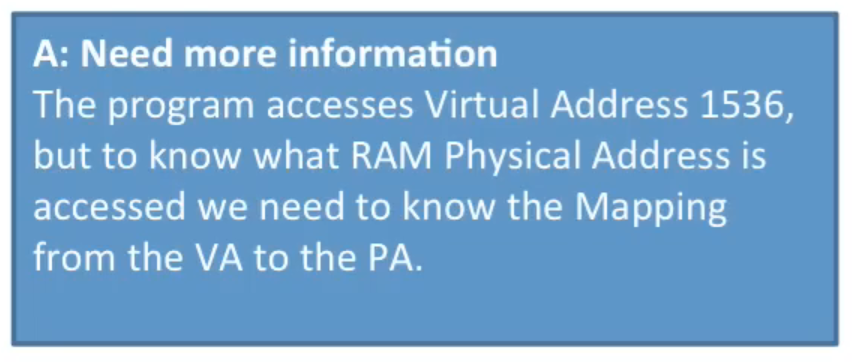
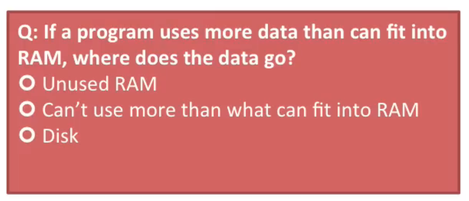
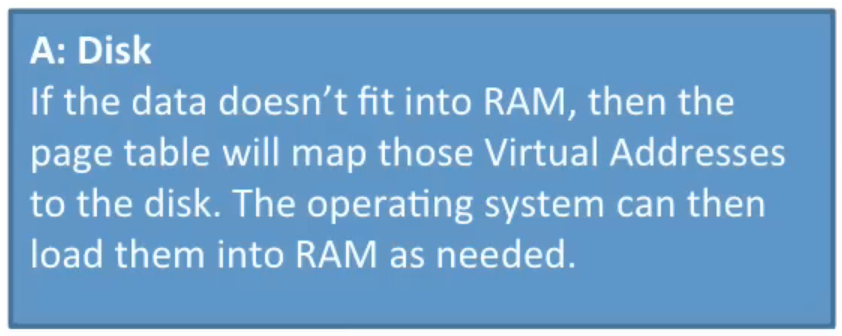

# How Virtual Memory Works

## Some pre reqs

1. What is MIPS. Its a [computer architecture. Microprocessor without Interlocked Pipelined Stages](https://en.wikipedia.org/wiki/MIPS_architecture)

2. [Instruction set architecture or ISA] is an abstract model that generally defines how software controls the CPU in a computer. MIPS is an ISA.

## Notes
1. Introducing two concepts here. `Virtual` and `Physical addresses` and we will also introduce some acronyms for them .
2. The basic idea is we have separate memory Spaces. 
   1. `Virtual Memory` is what a program sees. This is what the MIPS ISA promises. So when we do a(ld is read as load)

```txt
ld R4, 1024(R0) 
```
   this accesses `virtual address` R0+1024=1024, and not `physical address`.

   2. `Physical Memory` is the physical Ram in the computer. So when you install memory in your computer or buy computer with memory this is what paying for. Its whats on your machine.
   3. If you have 2 GB of RAM installed you're going to have physical addresses from 0 to 2^31-1. That's 2 billion bytes of memory. 
   4. `Virtual addresses` or `va`, is what the program uses and in Mips. It's a 32bit address Space.
   5. The `Physical addresses` or `pa` is what the hardware uses to talk to the Ram.
   6. And this is determined by How much Ram you have installed. If you only have a little bit of RAM installed your physical address Space(pa) is going to be small. If you have a lot of RAM it's going to be big. But now we have separate address Spaces here, so each program is going to have its own virtual add space and we have a physical address Space.

       

   7. How does a program access memory? The program executes a load and the load is going to specify a `virtual address`. Because that's the way programs work.
   8. Here shows a Processor It's running in the program virtual address space and here our load. 
   9. So load R3 1024 r0.

      

   10. Its the Map that translates the Virtual Address to the Physical Address. It's going to tell us how to get the data over. Here is the(the green RAM) data we want for R3 and this map is going to tell us how to get there. We want virtual add 1024, the map looks it up in the trnaslation tables. It says Oh virtual add 1024 Maps to the physical ADD 2. So It Goes and gets the data.
   11. If the data is not in Memory it goes and loads it from disk. In this case it is in memory and the data is returned. 
   12. So we took virtual address 1024, then translated it to physical address 2, and finally we send this back, so the program get the data.

   13. Now we go ahead and do another instruction this instruction Here is going load virtual address 512 so we go over to our translation, ask Where 512 go it say goes to physical address 12 so physical add 12 here(12th row in the green stack), go ahead and get our data and we send it back 

         

   14. Now we do another instruction This is an add instruction it's just using registers so we don't need to do any translation here.

         

   15.  Next we have another instruction This is going to access virtual address 786. We go to virtual address 786 the map tells us that its on disc it's not in memory. 

         

   16.  Okay it's on disk. So what do we need to do to get it? Well we need to Load it to memory. So go ahead and load this data into memory. Once we load memory, now we go update the translation map. 

   17.  Now we no longer want to translate address 786 to disk we want to translate address 786 to this location in memory so Update that to four Now when we put in virtual address 786 we get out physical address 4 we go ahead and Load it from data from the memory. And We return the value.

         

   18. Question. What add is located here so address r12 has a value 1536 and the program issues this load What location Ram is going to be accessed?

         

   19. Well We need more information here. The program is accessing virtual add 1536, but we don't know physical add. We need Map(translation). 

         

   20. Here is another question.

         

   21. Answer

         


## Reference
1. https://www.youtube.com/watch?v=59rEMnKWoS4
2. https://www.youtube.com/watch?v=59rEMnKWoS4&list=PLiwt1iVUib9s2Uo5BeYmwkDFUh70fJPxX

## Some basic Math for Memory calcs

| Two | Power  |  In Words                    | Value                | Kb/Mb/Gb  |
| :-- | :------| :---------------------------:| :--------------------|-----------|
| 2	| 1	   |  2 raised to power 1	    | 2	               |           |
| 2	| 2	   |  2 raised to power 2	    | 4	               |           |
| 2	| 3	   |  2 raised to power 3	    | 8	               |           |
| 2	| 4	   |  2 raised to power 4	    | 16	               |           |
| 2	| 5	   |  2 raised to power 5	    | 32	               |           |
| 2	| 6	   |  2 raised to power 6	    | 64	               |           |
| 2	| 7	   |  2 raised to power 7	    | 128	               |           |
| 2	| 8	   |  2 raised to power 8	    | 256	               |           |
| 2	| 9	   |  2 raised to power 9	    | 512	               |           |
| 2	| 10	   |	2 raised to power 10	    | 1024	               |   1KB     |
| 2	| 11	   |	2 raised to power 11	    | 2048	               |           |
| 2	| 12	   |	2 raised to power 12	    | 4096	               |           |
| 2	| 13	   |	2 raised to power 13	    | 8192	               |           |
| 2	| 14	   |	2 raised to power 14	    | 16384	               |           |
| 2	| 15	   |	2 raised to power 15	    | 32768	               |           |
| 2	| 16	   |	2 raised to power 16	    | 65536	               |           |
| 2	| 17	   |	2 raised to power 17	    | 131072	         |           |
| 2	| 18	   |	2 raised to power 18	    | 262144	         |           |
| 2	| 19	   |	2 raised to power 19	    | 524288	         |           |
| 2	| 20	   |	2 raised to power 20	    | 1048576	         |   1MB     |
| 2	| 21	   |	2 raised to power 21	    | 2097152	         |           |
| 2	| 22	   |	2 raised to power 22	    | 4194304	         |           |
| 2	| 23	   |	2 raised to power 23	    | 8388608	         |           |
| 2	| 24	   |	2 raised to power 24	    | 16777216	         |           |
| 2	| 25	   |	2 raised to power 25	    | 33554432	         |           |
| 2	| 26	   |	2 raised to power 26	    | 67108864	         |           |
| 2	| 27	   |	2 raised to power 27	    | 134217728	         |           | 
| 2	| 28	   |	2 raised to power 28	    | 268435456	         |           | 
| 2	| 29	   |	2 raised to power 29	    | 536870912	         |           | 
| 2	| 30	   |	2 raised to power 30	    | 1073741824	         |  1GB      |
| 2	| 31	   |	2 raised to power 31	    | 2147483648	         |  2GB      |
| 2	| 32	   |	2 raised to power 32	    | 4294967296	         |  4GB      | 

