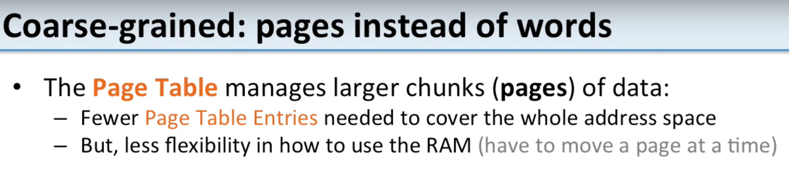
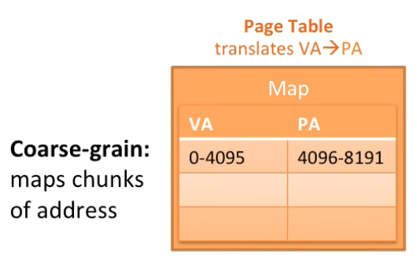

# Page Tables

## Some pre reqs

1. What is MIPS. Its a [computer architecture. Microprocessor without Interlocked Pipelined Stages](https://en.wikipedia.org/wiki/MIPS_architecture)

2. [Instruction set architecture or ISA] is an abstract model that generally defines how software controls the CPU in a computer. MIPS is an ISA.

## Notes
1. `Page Table` is the mapping that keeps track of these `virtual address` to `physical address` mappings. 
2. We're going to see why we call it a `page table`.
3. We saw before that we have this map from the `virtual addresses` to the `physical addresses`
4. This map is in the form of table, and call this the `page table`.
5. We had one entry or one page table entry for every `virtual address` 
6. Here we had one entry for address 512 one entry for 786 and we also had entries for all the words in between these as well 

    

7. How big is this? If we need one entry in our page table for every virtual address, remember virtual addresses are word access how many do we need?

    

8. We have a word alligned memory. So we need to be able to address every word. So we need one for every word so that's 2 to the power 30 or 1 billion entries.

9. That means the table here for a 32-bit program address space has to be able to fit a billion entries in it and each one of these entries is pretty big. Each entry in the table has to say what's the virtual address and the physical address so each entry itself is at least 32 bits. So that means this is about one gigabyte of memory just to keep track of this page table.

10. We'd have to use up a whole gigabyte of memory just to keep track of the memory for one particular program.

11. So how are we going to solve this? Well let's talk about `page table size`

12. We need to translate every address our programs have, a 32-bit `virtual address space`  and our programs have to be able to access everything in it or the programs can't use all their address space.

    

13. So it's two to the 30 words that need page table entries. If we have one entry for every word, it's a billion entries. That's way too many entries. Now remember if we don't have a page table entry then we can't access that location. 
14. We need the page table entry to get the physical address so we can actually load the data. So we have to have some sort of page table entry for every single word in our virtual address space.
15. So how can we make this more manageable? 
16. Well here's what we had before we had this fine grain mapping each word was mapped in our table.

    

17. What we can do is we can have it in bigger chunks, so we divide our memory into chunks and we're going to call these chunks Pages. That's why it's called a `page table` entry instead of `words`. 

18. Here's what this looks like with coarse grain. We have a whole page where we're saying that virtual addresses 0 through 4095 are going to map to physical addresses 4096 to 8191. 

    

19. Instead of having one entry in our page table map one word, now we have one entry in our page table is going to map this whole chunk of memory, and we're going to call this `chunk of memory` or a page. So in this case we have these four kilobyte pages.

20. Each entry in our page table now handles four kilobytes of data. Before we had each entry in our page table handling one word or four bytes of data. Now each chunk here is 1024 times larger than they were. So we need 1,000th as less of these entries. This makes our page table much smaller.  

21. So our page table is no longer going to man manage entries for each word, but instead, it's going to manage entries for each page, so we have fewer entries needed to cover the whole address space. 

    

22. There's also tradeoff here, notice it's less flexible. Before we could move each word at a time, but now, we're going to have to move 4,096 bytes at a time, 4 kilobytes every time we want to move a page, so if we need to move something out to disk to make room, we're going to have to move out 4,096 bytes at a time to make room, so today we typically have 4 kilobyte Pages, and it's 1024 words per page. 

    

23. And here's a question about them how many entries do we need in our page table now that we have 4 kilobyte Pages for this 32bit machine? 

24. Well we need one entry for every 1024 words it's a 4 kilobyte page each word is 4 bytes so that's 1,024 words per page so that's going to be 1 million entries. So this is great, instead of needing a billion entries like we did before we now just need 1 million. This is enormously more manageable, so before our page table was a gigabyte in size now it's going to be about 4 megabytes in size which is much more reasonable.

25. In fact people even go further than this so today you have lots of 64-bit machines, its very common to use 2 megabyte pages, In a 2 megabyte page you get, 520,000 words per page.

26. This allows you to cover more of memory space with a smaller page table. So there's a trade-off here cover more memory space with a smaller page table but you have to move a whole page at a time so you get less flexibility 

27. Now how do we map addresses within a page. So before this was really easy you just looked up the word address in your page table and it told you what the physical address is. 

28. But now our page table tells us that all the addresses in this range map to this range.
        
    

29. So how do we look something up? To do this we think about our virtual address space and our physical address space in pages. So here are the pages here's the first page in our `virtual address space` it's address 0 to 4095 the second page the third page the fourth page Etc. 
    
    

30. The same thing for our `physical address space` we have Pages now in this example our physical address space is smaller than our virtual address space so it has fewer Pages.

31. Now we want to go ahead and see how this translation works. So this translation tells us that virtual address is 0 to 4095. That's addresses in this page are translated to physical address is 4096 to 8,191. So that's saying that this page is translated over here to this page.

    

32. So instead of pointing to individual words we're just saying this whole page gets translated this whole page. 
33. Now that's fine but here's a question what's the physical address for virtual address 4.

    

34. Though the map doesn't have an entry for 4 it just has a map for this range, so how do we translate that?
35. Well the answer it's going to be 4100. All of the virtual addresses in this range are going to be mapped into this physical page here. so address four over here is offset by four bytes from the start of this page so we can figure out where this page Maps it Maps over here and then we know that this word is going to be offset by four bytes over here in this physical page. 

    

36. So it's going to be four bytes off from address 496 so it's going to be address 4100.

## Reference
1. https://www.youtube.com/watch?v=KNUJhZCQZ9c
2. https://www.youtube.com/watch?v=KNUJhZCQZ9c&list=PLiwt1iVUib9s2Uo5BeYmwkDFUh70fJPxX&index=5

## Some basic Math for Memory calcs

| Two | Power    |  In Words                   | Value                | Kb/Mb/Gb  |
| :-- | :--------| :--------------------------:| :--------------------|-----------|
| 2	  | 1	     |  2 raised to power 1	       | 2                     |           |
| 2	  | 2	     |  2 raised to power 2	       | 4                     |           |
| 2	  | 3	     |  2 raised to power 3	       | 8                     |           |
| 2	  | 4	     |  2 raised to power 4	       | 16	                   |           |
| 2	  | 5	     |  2 raised to power 5	       | 32	                   |           |
| 2	  | 6	     |  2 raised to power 6	       | 64	                   |           |
| 2	  | 7	     |  2 raised to power 7	       | 128	               |           |
| 2	  | 8	     |  2 raised to power 8	       | 256                   |           |
| 2	  | 9	     |  2 raised to power 9	       | 512                   |           |
| 2	  | 10       |	2 raised to power 10       | 1024                  |   1KB     |
| 2	  | 11       |	2 raised to power 11       | 2048                  |           |
| 2	  | 12       |	2 raised to power 12       | 4096                  |           |
| 2	  | 13       |	2 raised to power 13       | 8192                  |           |
| 2	  | 14       |	2 raised to power 14       | 16384                 |           |
| 2	  | 15       |	2 raised to power 15       | 32768                 |           |
| 2	  | 16       |	2 raised to power 16       | 65536                 |           |
| 2	  | 17       |	2 raised to power 17       | 131072                |           |
| 2	  | 18       |	2 raised to power 18       | 262144                |           |
| 2	  | 19       |	2 raised to power 19       | 524288                |           |
| 2	  | 20       |	2 raised to power 20       | 1048576               |   1MB     |
| 2	  | 21       |	2 raised to power 21       | 2097152               |           |
| 2	  | 22       |	2 raised to power 22       | 4194304               |           |
| 2	  | 23       |	2 raised to power 23       | 8388608               |           |
| 2	  | 24       |	2 raised to power 24       | 16777216              |           |
| 2	  | 25       |	2 raised to power 25       | 33554432              |           |
| 2	  | 26       |	2 raised to power 26       | 67108864              |           |
| 2	  | 27       |	2 raised to power 27       | 134217728             |           | 
| 2	  | 28       |	2 raised to power 28       | 268435456             |           | 
| 2	  | 29       |	2 raised to power 29       | 536870912             |           | 
| 2	  | 30       |	2 raised to power 30       | 1073741824            |  1GB      | 1 Billion 
| 2	  | 31       |	2 raised to power 31       | 2147483648            |  2GB      |
| 2	  | 32       |	2 raised to power 32       | 4294967296            |  4GB      | 
