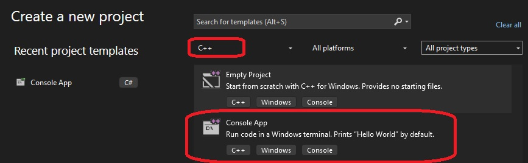

# Process Enumeration

## How this project is created.
1. Fire up visual studio 


2. Select C++ Console Project and click Next(find it at bottom right).



Or you this.


3. First console app. Name the project, select location and click Create(find it at bottom right)


4. Console App in Visual Studio. Optionally you can rename the cpp file to main.cpp.


## Notes
1. Simple program to enumerate processes.
2. If you want to be stealthy and inconspiquous, then instead of using higher languages like C#, use windows API.
3. Include the following.
```cpp
#include <Windows.h>
#include <stdio.h>
#include <TlHelp32.h>
```

3. The following structure holds the information after we start the enumeration process.Press F12 to see the structure

```cpp
PROCESSENTRY32 pe;
```


## References
1. https://learn.microsoft.com/en-us/windows/win32/toolhelp/taking-a-snapshot-and-viewing-processes
2. 


