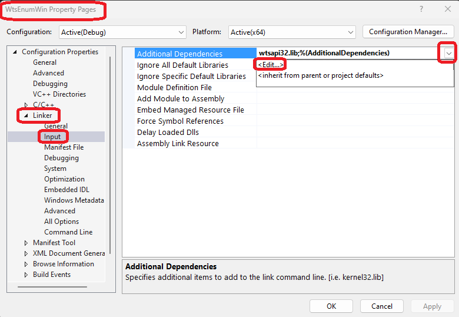
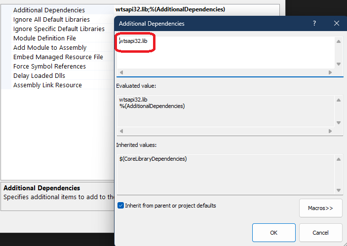

# Process Enumeration

## How this project is created.
1. Create console app as in an earlier example.

2. Next, as the [documentation](https://learn.microsoft.com/en-us/windows/win32/api/wtsapi32/nf-wtsapi32-wtsenumerateprocessesexa) explains (see bottom of page) this function requires you to link with wtsapi32.lib. This library isn't linked with by default, you need to add it to the linker settings in your project.



Here is the edit.



3. This changes add the additional dependencies in proj file as follows.

```xml
<AdditionalDependencies>%(AdditionalDependencies)</AdditionalDependencies>
```

to 

```xml
<AdditionalDependencies>wtsapi32.lib;%(AdditionalDependencies)</AdditionalDependencies>
```

4. There is another way, to add this pragma on the top.

```cpp
#pragma comment(lib, "wtsapi32.lib")
```

5. 

## Notes
1. Windows Terminal Services.
2. A set of functions intended for terminal services environment, but work equally well in a local environment.
3. Functions exist for enumerating processes, sessions and getting detailed session information
4. [WTSEnumerateProcesses(Ex)](https://learn.microsoft.com/en-us/windows/win32/api/wtsapi32/nf-wtsapi32-wtsenumerateprocessesexa). 
5. Ex is extended version.

6. [WTS_CURRENT_SERVER_HANDLE](https://learn.microsoft.com/en-us/windows/win32/api/wtsapi32/nf-wtsapi32-wtsenumerateprocessesexw#parameters) indicates the server on which your application is running

7. The second parameter is `level`, a double word or `DWORD`. This can take 0 or 1. 0 provides basic information, and 1 provides extended information. 

8. The 3rd param is session for which to enumerate processes. To enumerate processes for all sessions on the server, specify WTS_ANY_SESSION.

9. The next is a 
```cpp
PWTS_PROCESS_INFO_EX info;
```

10. The enable debug prvlates method is described in the SecurityToken.md

## References
1. https://learn.microsoft.com/en-us/windows/win32/toolhelp/taking-a-snapshot-and-viewing-processes
2. https://winterdom.com/dev/security/tokens/
3. https://learn.microsoft.com/en-us/windows/win32/api/wtsapi32/nf-wtsapi32-wtsenumerateprocessesexa
4. https://stackoverflow.com/q/79124363/1977871


