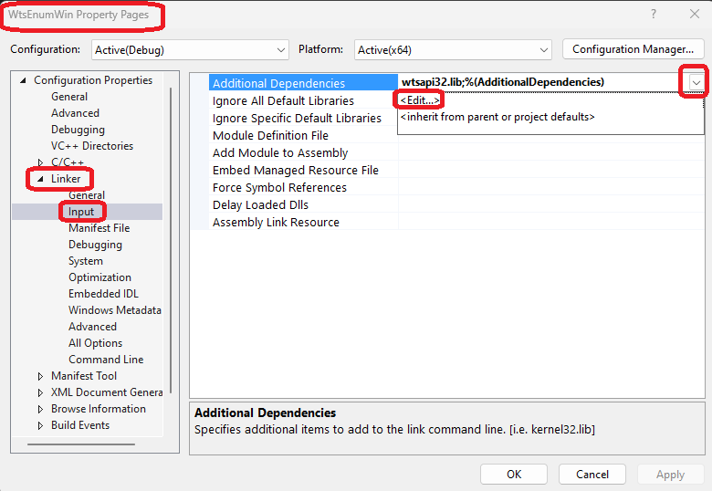
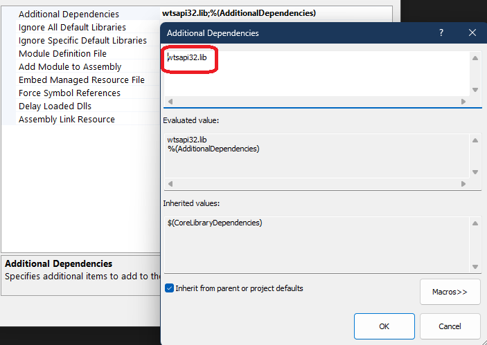

# Process Enumeration

## How this project is created.
1. Create console app as in an earlier example.

2. Next, as the [documentation](https://learn.microsoft.com/en-us/windows/win32/api/wtsapi32/nf-wtsapi32-wtsenumerateprocessesexa) explains (see bottom of page) this function requires you to link with wtsapi32.lib. This library isn't linked with by default, you need to add it to the linker settings in your project.



Here is the edit.



3. This changes add the additional dependencies in proj file as follows.

```xml
<AdditionalDependencies>%(AdditionalDependencies)</AdditionalDependencies>
```

to 

```xml
<AdditionalDependencies>wtsapi32.lib;%(AdditionalDependencies)</AdditionalDependencies>
```

4. There is another way, to add this pragma on the top.

```cpp
#pragma comment(lib, "wtsapi32.lib")
```

5. 

## Notes
1. Windows Terminal Services.

## References
1. 

