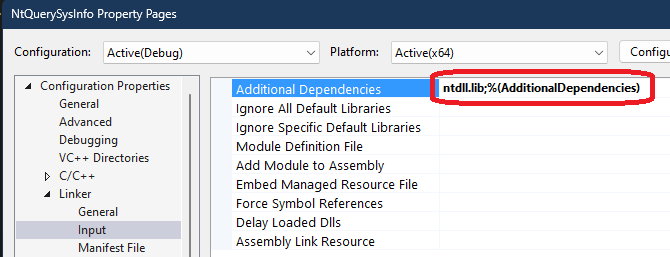

# Nt Query System Information

## How this project is created.
1. Part of the Windows native (and undocumented) API
2. Provided by NtDll.Dll
3. The various documented Windows APIs use the native API internally
4. Richest information with a single function call.
5. The best resource for the native API definitions is the [Process Hacker project](https://github.com/processhacker/phnt)
6. Here is the edit.



```cpp
#pragma comment(lib, "ntdll")
```

## Notes
1. Windows Terminal Services.

## References
1. https://github.com/processhacker
2. 

