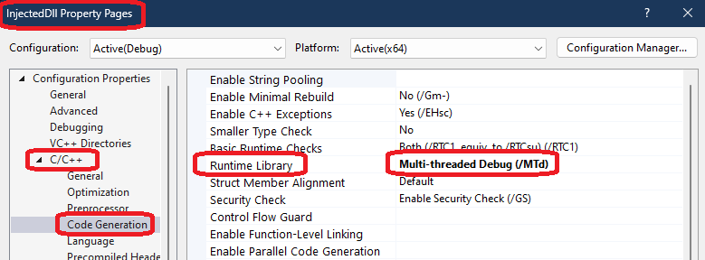
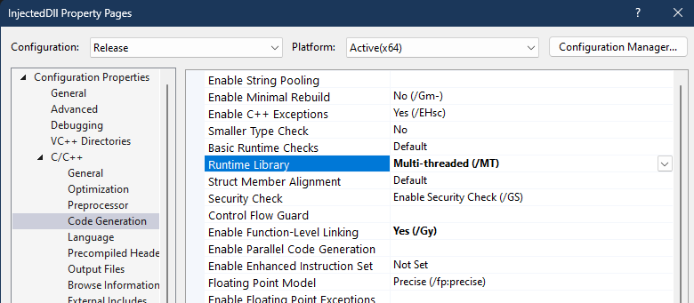
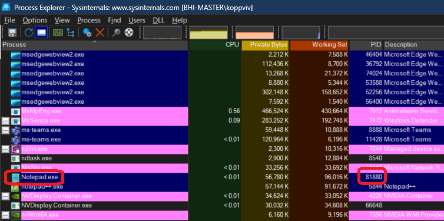
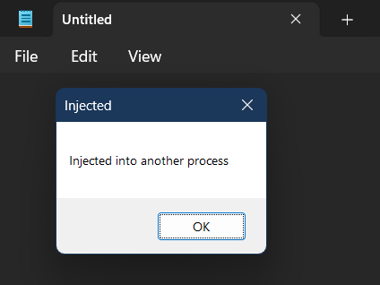
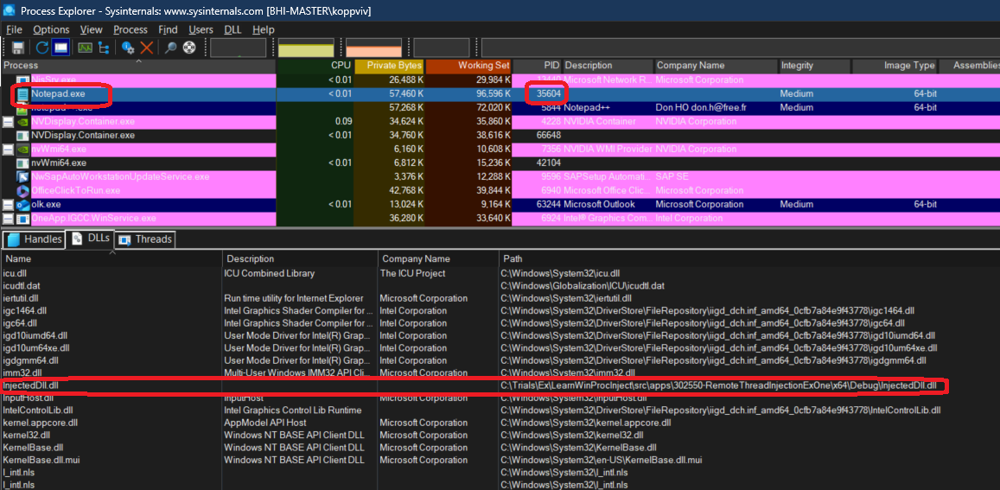

# Remote Thread Injection

## How this solution is created.
1. Create a balnk solution and then add new regular c++ console application as done in one of the earlier example `CreateToolHelpIntro`. 

2. Right click on the solution and add a new project. 
   


3. Name it say InjectedDll.


## Notes
1. Create a thread in the target process and instruct that thread to load a desired DLL. And that dll is going to be called, and we can do what ever we want. In this example, we will inject a dll into a `notepad` process.

2. This is one of the oldest, if not the oldest. This is not used these days, because its easily detectable by anti malvare solutions.

3. So here is the target process and attacker process. The attacker process is created using some social engineering, attacment, script etc.

4. The attacker process opens a handle to the target process. This enables us to do some stuff in that process. Then write the path to the dll into the target process, using the `WriteProcessMemory` function.


5. Next the attacker(CreateRemoteThreadProj) will call the `CreateRemoteThread` function. This will create thread in the target(notepad) process and tell the thread to start running, the function `LoadLibrary`. `CreateRemoteThreadProj` is a cpp console app, and the process id of a running notepad app needs to be provided to this console app as command line args.


6. The `LoadLibrary` function is the one that can load the dll. This function will be given the path to the dll written in the target process. Our dll will then be loaded into memory of the target(notepad) process. So this path o the dll will be second command line argument of the `CreateRemoteThreadProj` console app, the first being the notepad process id.


7. Then we can remove the attcker process form existance. Our dll is hiding inside the target(notepad) process. 

8. So the InjectedDll project is the second project in the solution. This is a dynamic linked lib(dll) project. This dll will be injected into the notepad. This project will have a function called `DllMain`. Look for it. In general, this function is called in several cases, and one of the cases is when this dll is loaded into a process. 

```cpp
// dllmain.cpp : Defines the entry point for the DLL application.
#include "pch.h"

BOOL APIENTRY DllMain( HMODULE hModule,
                       DWORD  ul_reason_for_call,
                       LPVOID lpReserved
                     )
{
    switch (ul_reason_for_call)
    {
    case DLL_PROCESS_ATTACH:
    {
        MessageBox(nullptr, L"Injected into another process", L"Injected", MB_OK);
    }
    case DLL_THREAD_ATTACH:
    case DLL_THREAD_DETACH:
    case DLL_PROCESS_DETACH:
        break;
    }
    return TRUE;
}
```

9. For our case, it is process attach, which is `DLL_PROCESS_ATTACH`, the first case. Note the following in the in the above code base in `case DLL_PROCESS_ATTACH` 

```cpp
case DLL_PROCESS_ATTACH:
{
    MessageBox(nullptr, L"Injected into another process", L"Injected", MB_OK);
}
```

10.  FOr the InjectedDll project, in the C++ Code generation(see below), the Runtime library is Multi-threaded Debug DLL by default. This is not very good idea for another dll to come into that target process, because that creates a dependency, it can fail the loading of the dll. We need to ensure to change that to static library for the runtime library, weather its debug or release. Change as follows.  



And for release its as follows. So this links statically, without extra dependencies on the c runtime library. 



11.  Now build and run. Follow the commands.sh command sequence. 

12.  When notepad process is started, open the process explorer and search for notepad and get its id.



13. Final output.



14. Dlls in the Notepad.exe in process exlorer.



15. 

## References
1. 
2. 

