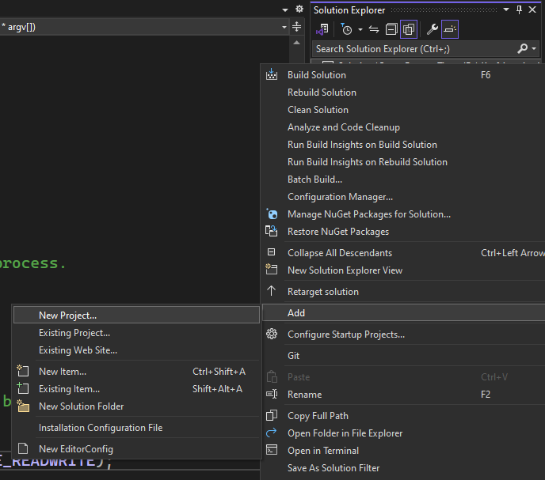
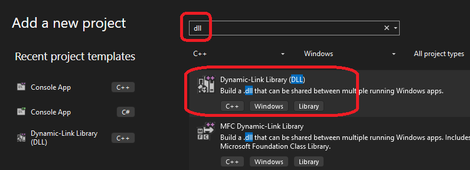
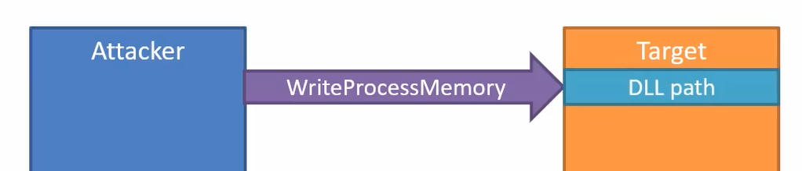
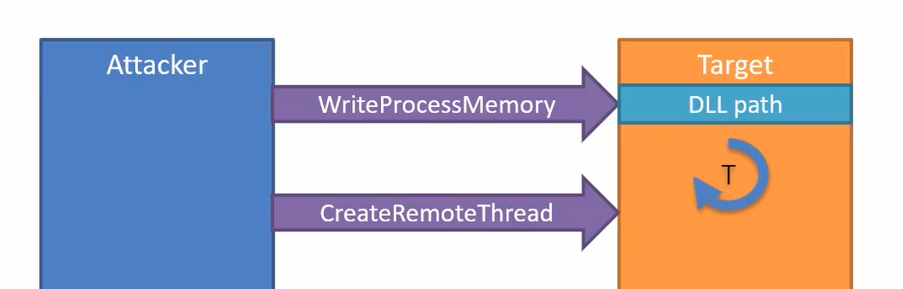
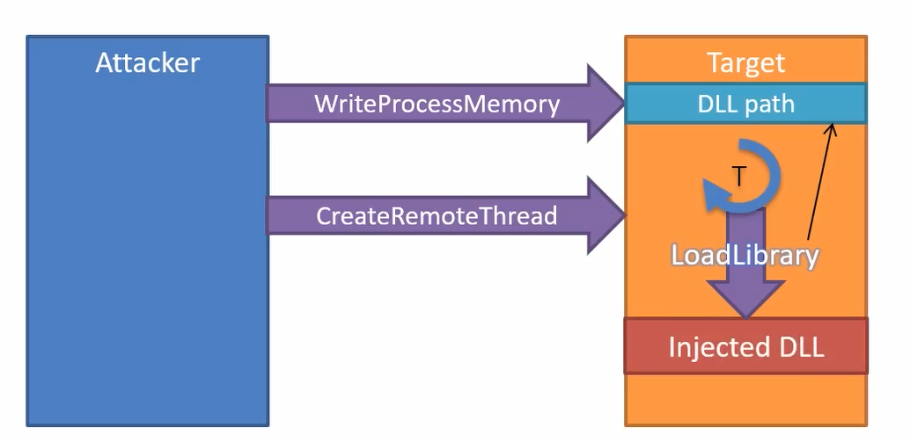

# Remote Thread Injection

## How this solution is created.
1. Create a balnk solution and then add new regular c++ console application as done in one of the earlier example `CreateToolHelpIntro`. 

2. Right click on the solution and add a new project. 
   


3. Name it say InjectedDll.




## Notes
1. Create a thread in the target process and instruct that thread to load a desired DLL. And that dll is going to be called, and we can do what ever we want.
2. This is one of the oldest, if not the oldest. This is not used these days, because its easily detectable by anti malvare solutions.
3. So here is the target process and attacker process. The attacker process is created using some social engineering, attacment, script etc.

4. The attacker process opens a handle to the target process. This enables us to do some stuff in that process. Then write the path to the dll into the target process, using the `WriteProcessMemory` function.



5. Next the attacker will call the `CreateRemoteThread` function. This will create thread in the target process and tell the thread to start running, where the function `LoadLibrary` is.



6. The `LoadLibrary` function is the one that can load the dll. This function will be given the path to the dll written in the target process. Our dll is going to be loaded into memory. 



7. Then we can remove the attcker process form existance. Our dll is hiding inside the target process. 

8. The InjectedDll project will have a function called `DllMain`. Look for it. This function is called in several cases, and one of the cases is when this dll is loaded into a process. 

```cpp
// dllmain.cpp : Defines the entry point for the DLL application.
#include "pch.h"

BOOL APIENTRY DllMain( HMODULE hModule,
                       DWORD  ul_reason_for_call,
                       LPVOID lpReserved
                     )
{
    switch (ul_reason_for_call)
    {
    case DLL_PROCESS_ATTACH:
    {
        MessageBox(nullptr, L"Injected into another process", L"Injected", MB_OK);
    }
    case DLL_THREAD_ATTACH:
    case DLL_THREAD_DETACH:
    case DLL_PROCESS_DETACH:
        break;
    }
    return TRUE;
}
```

9. For our case, it is process attach, which is `DLL_PROCESS_ATTACH`, the first case. Note the following in the in the above code base in `case DLL_PROCESS_ATTACH` 

```cpp
case DLL_PROCESS_ATTACH:
{
    MessageBox(nullptr, L"Injected into another process", L"Injected", MB_OK);
}
```


## References
1. 
2. 

