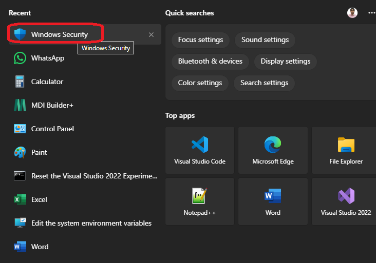
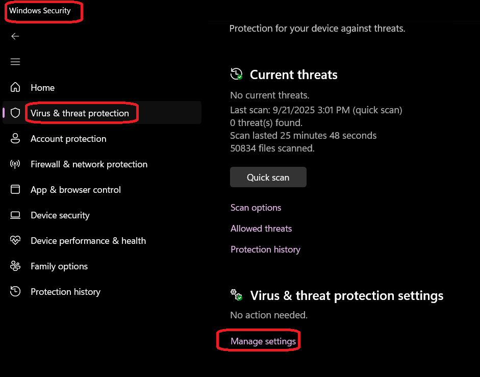
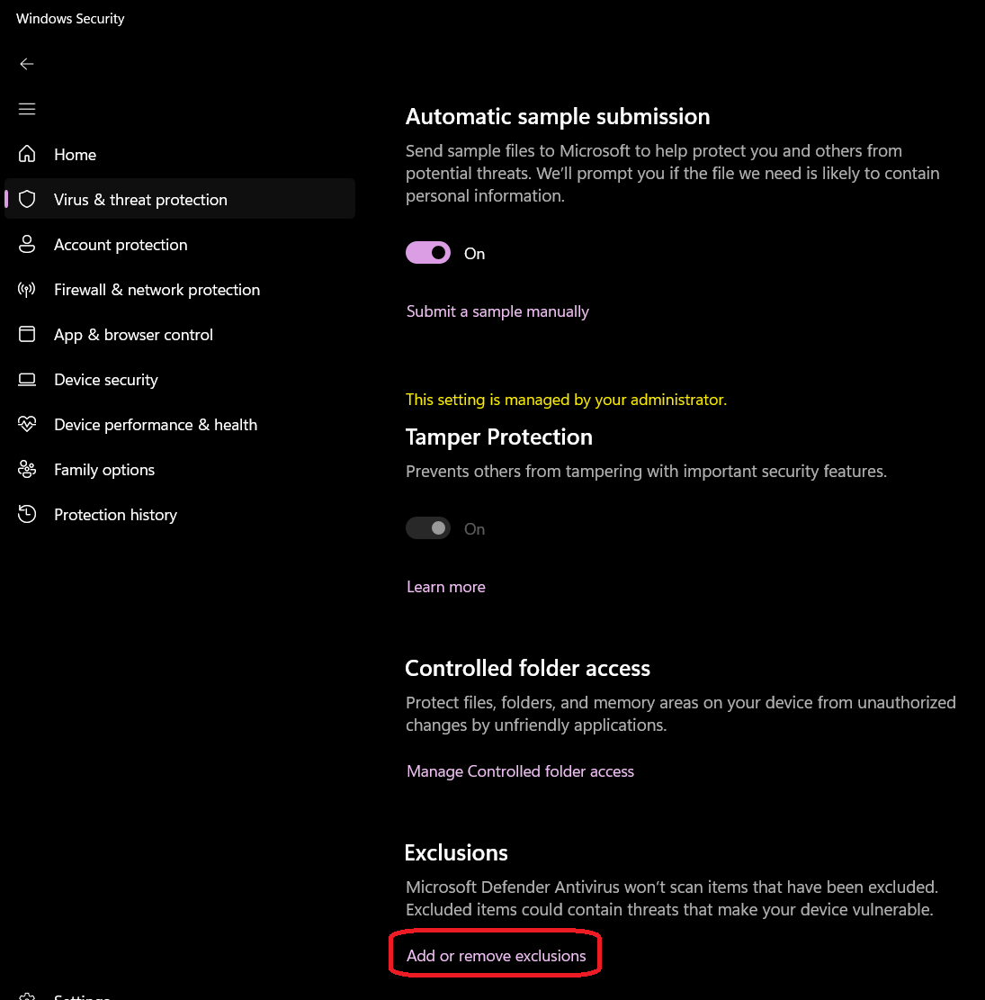
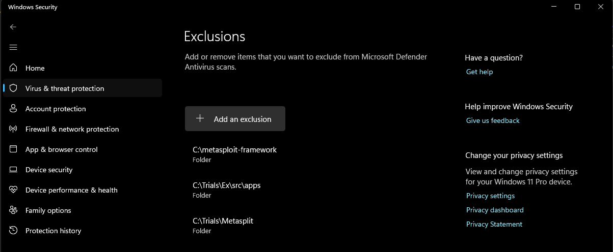

# C# CSharp Process Injection

This repository contains examples of process injection techniques implemented in C#. The examples demonstrate how to inject shellcode into a target process using various methods.

This example is not running on my laptop because of Windows Defender. You can try it on a VM.
You need to disable Windows Defender or add an exclusion for the compiled executable.

The following are the steps to exclude the folder in Windows Defender:

1. Open Windows Security. You can do this by searching for "Windows Security" in the Start menu.
   
2. Click on "Virus & threat protection."
   
3. Under "Virus & threat protection settings," click on "Manage settings."
4. Scroll down and click on "Add or remove exclusions."
     
5. Click on "Add an exclusion" and select "Folder."
    
6. Choose the folder where the compiled executable is located.

I tried the following but it didn't work:

```ps
powershell -inputformat none -outputformat none -NonInteractive -Command Add-MpPreference -ExclusionPath "C:\Trials\Ex\LearnWinProcInject\src\apps\405800-SimpleShellCode"
```

I got the above from this link. https://stackoverflow.com/a/78449995/1977871


Why Windows Defender Blocks This Code
•	This code allocates executable memory, copies raw shellcode into it, and creates a new thread to execute that shellcode.
•	These are classic techniques used in malware (shellcode injection and execution).
•	Antivirus and Windows Defender use heuristics to detect such patterns and will block or quarantine binaries that perform these actions, even if your intent is benign.
Summary:
The combination of VirtualAlloc with PAGE_EXECUTE_READWRITE, copying a suspicious byte array, and executing it via CreateThread is what triggers the security software.


Difference between VirtualAllocEx and VirtualAlloc

- VirtualAlloc is used to reserve or commit a region of memory within the address space of the calling process. It cannot be used to allocate memory in another process.
- VirtualAllocEx, on the other hand, is used to allocate memory in the address space of a specified process. This is particularly useful for process injection scenarios where you need to allocate memory in a target process. 


## References

1. https://stackoverflow.com/a/78449995/1977871
2. https://github.com/tasox/CSharp_Process_Injection
3. https://crypt0ace.github.io/posts/WinAPI-and-PInvoke-in-CSharp/
4. https://crypt0ace.github.io/posts/Shellcode-Injection-Techniques/
5. https://gist.github.com/crypt0ace/4d03eaaac958d73bb665f4ca7d068a68
6. https://github.com/crypt0ace/CS-ShellcodeInjection
7. https://github.com/crypt0ace/CS-Unhook - Not sure what this unhooking is.
8. https://github.com/crypt0ace/CS-APCInjection - Need to look into this.
9. 
10. 


